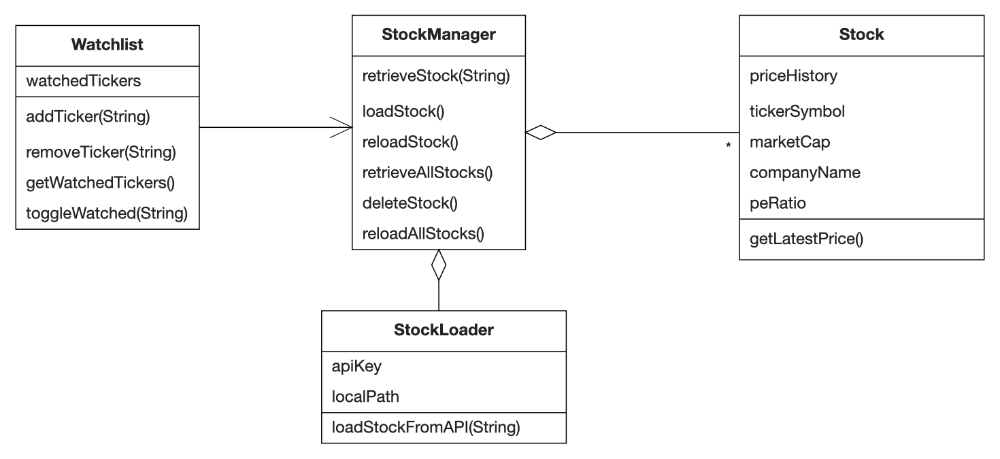
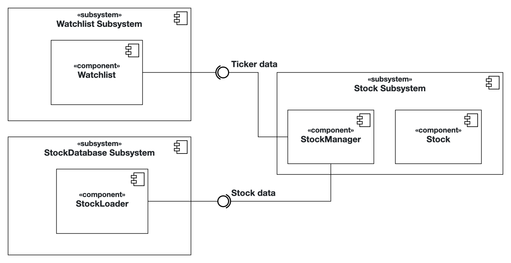

# Intro Course Project App of Yannick Wiest for the iPraktikum

## Problem Statement (max. 500 words)

As a stock market enthusiast, navigating the vast array of available stocks can be overwhelming, especially when it comes to comparing key metrics and performance trends. Without an efficient way to analyze and compare stock data, I often find myself spending too much time gathering information from multiple sources, making it difficult to make informed investment decisions quickly.

To help streamline this process, I need an iOS application that allows me to look at a stock. Especially, I am interested in financial data such as price-to-earnings ratio (P/E), market cap, and price history. The app should also provide a visual for stock price trends through graphs. This way, I can spot performance trends, compare growth trajectories, and make better-informed decisions at a glance.

Additionally, the app should allow me to star or favorite stocks that I want to keep a close eye on, creating a personalized watchlist. The app should also provide a list of top-performing stocks according to the mentioned key metrics. This will give me a broader market overview and help identify trends or opportunities across different sectors.

In summary, as a stock market enthusiast looking to optimize my investment decisions, I need an iOS application that can help me compare stocks and track their performance. With such an app, I can make more confident and informed decisions, ultimately improving my overall investment strategy. 

## Requirements

The stock enthusiast should be able to:
... search for stocks in a search bar and download data.  
... access stock data from the local storage and the API.  
... view a graph of stock price evolution.  
... view key metrics of a stock including P/E, price, and market volume.  
... star favorite stocks to add them to a watchlist.  
... remove no longer needed stocks from his collection.  
... view a list of top-performing stocks according to key metrics.  

## Analysis

## System Design

## Product Backlog

[x] iStock-1 Calculate key metrics for stock  
[x] iStock-2 Search stock related to ticker  
[x] iStock-3 View stock  
[x] iStock-4 Watchlist stock  
[x] iStock-5 Retrieve all stocks in watchlist  
[x] iStock-6 View top-performing stocks  
[x] iStock-7 Load stock data from API  
[x] iStock-8 Delete stock data  

